# **hyperCube**
## **Site Overview**

hyperCube is an endless, side-scrolling jumping game in which the player has to jump a series of randomly spaced cubes or 'monoliths' that slide towards the player at increasing speed. The synopsis for the game is as follows: 
"Whilst on a routine patrol at the edge of the galaxy, your hyperdrive malfunctioned, rupturing space and time. You have been pulled into an alternate 2D reality where the rules of our universe no longer apply. After crashing on a deserted world, the mysterious laws of this place have transformed your human body into a hyperCube. Stars drift towards the heavens and menacing black monoliths are drawn towards you with increasing speed. If there is any hope of escape from this place, you have no choice other to first survive by jumping the monoliths."

The synopsis is displayed on a splash screen which counts down from 20 before showing the game page. Alternatively the user can skip the splash screen using the 'skip' button.

The game has sound effects and music (see credits for details) which can be toggled on or off. The default setting is no sound or music. 

The player jumps by pressing the space bar on devices with a keyboard or by tapping the screen on touch devices.

There is a high score table which the user can add their name to; it stores the top five scores and there is a 'clear button' to remove those from local storage.

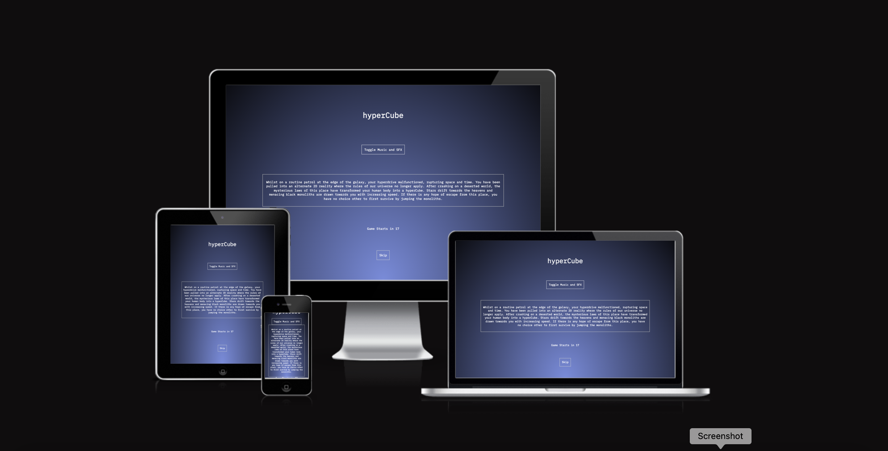
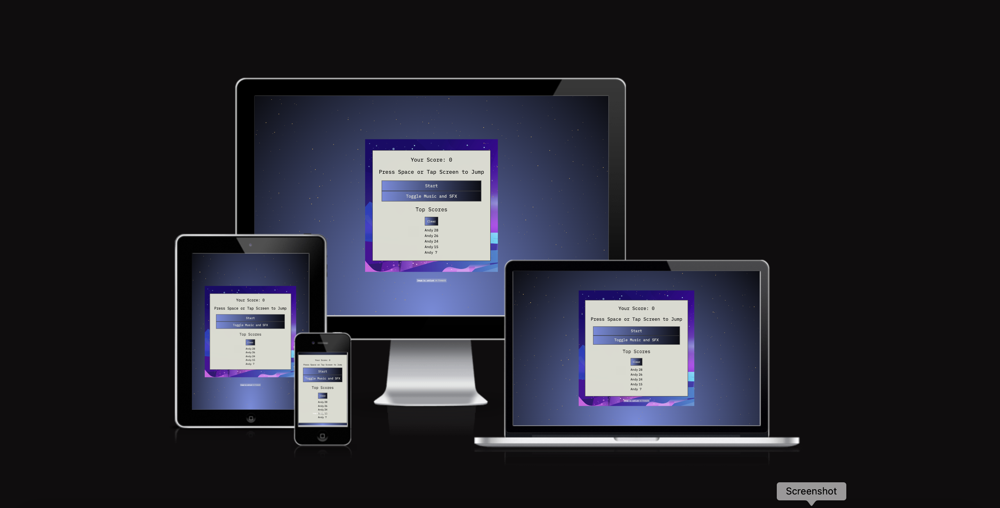

​
## Table of contents:
1. [**Site Overview**](#site-overview)
1. [**Planning stage**](#planning-stage)
    * [***Target Audiences***](#target-audiences)
    * [***User Stories***](#user-stories)
    * [***Site Aims***](#site-aims)
    * [***Wireframes***](#wireframes)
    * [***Color Scheme***](#color-scheme)
    * [***Typography***](#typography)
1. [**Current Features Common to all pages**](#current-features-common-to-all-pages)
    * [***Header Element***](#header-element)
    * [***Other Features***](#features)
    * [**Footer**](#footer)
1. [**Individual Page Content features**](#individual-page-content-features)
    * [**About Page Content**](#about-page-content)
    * [**Teachings Page Content**](#teachings-page-content)
    * [**Community Page Content**](#community-page-content)
    * [**Contact Page Content**](#contact-page-content)
    * [**Form Feedback Page Content**](#form-feedback-page-content)
1. [**Future-Enhancements**](#future-enhancements)
1. [**Testing Phase**](#testing-phase)
1. [**Deployment**](#deployment)
1. [**Tech**](#tech)
1. [**Credits**](#credits)
    * [**General reference**](#general-reference)
    * [**Content**](#content)
    * [**Media**](#media)
    * [**Honorable mentions**](#honorable-mentions)
​
## **Planning Stage**

 

#### **Target Audiences:**
* People who like casual gaming​.
* People who are looking for a simple yet challenging endless jumping game.
* People looking for a browser-based game.
* Aspiring developers looking for clearly-written JavaScript code and simple but effective logic.

​
#### **User Stories:**
* As a user, I want to understand the premise of the game.
* As a user, I want to quickly learn and understand the rules of the game and its instructions.
* As a user, I want to navigate the page to find what I require quickly and easily.
* As a user, I want the game to run smoothly and bug-free.
* As a user, I want to be able to control the music and SFX.
* As a user, I want to be able to save my score in the leaderboard.
* As a user, I want to be challenged.

​
#### **Site Aims:**
* To offer a simple yet challenging experience to the user.
* To provide a clean and simple interface for the user.
* To offer SFX and music based on the user's choice.
* To offer the user the option of saving their high score, or to clear the current list.
* To provide an interesting background to the canvas and game page with minimal distraction.

​​
#### **Wireframes:**

Wireframes for each of the different screens were created using Balsamiq. This process provided a basic but clear outline of how each page would look as well as organising the content.

* Splash Screen
[Splash Screen Wireframe](assets/images/hyperCube-splash-wireframe.png)

* Game Screen
[Game Screen Wireframe](assets/images/hyperCube-game-wireframe.png)

* Start Game and Leaderboard Card
[Start Game](assets/images/hyperCube-overlay-card-wireframe.png)

 ​

#### **Colour Scheme:**
​
For the splash screen I used a radial gradient: radial-gradient(ellipse at bottom, #758CDE 0%, #0C0D13 100%)
On the game screen I used a pure CSS animation of tiny stars drifting towards the top of the screen (please see credits below)
The canvas background is of a barren alien landscape (see credits)

 

The splash screen uses the radial gradient desrcibed above which is dark at the edges and lighter towards the centre. The font color used is white which contrasts starkly to the background and provides a clean introduction to the page. It makes the text stand out and it is easily readable. The borders of the boxes are slightly darker (#DADBD0) which provides a softer mid-point between the text and background.

The game page uses the same radial gradient but there is animated effect of stars drifting upwards. This is to emphasise the location and setting of space as well as to offer an insight into the physical laws of the fictional alternate universe. I applied the same gradient to the buttons on the overlay card and I think it looks good. Again the colors are dark to allude to the science-fiction/space context. They work well with the canvas background image.

​
#### **Typography**
​
* Throughout the page and game, the following fonts are used:
  * IBM Plex Mono (Regular 400) ('https://fonts.google.com/specimen/IBM+Plex+Mono?query=IBM+Pl') - This font was chosen to complement the sci-fi feel of the game and site. 
  * Monospace - As a fallback font in the event IBM Plex Mono wasn't supported by the browser
​
* All fonts were sourced from Google fonts, as stated in the credits.

​ 

## **Current Features Common to all Pages**

#### **Favicon**

* The favicon is a small image that displays in the browser tab. 
* The intention is to enhance the user experience for those who have multiple tabs open and cannot read the text in the tabs.
* The favicon is a simple lower case 'h' and upper case 'C' to reflect the styling of 'hyperCube' in the title of the game. The font color is the same (#DADBD0) as the one used on the splash and game screens, whilst the purple is found in the game canvas background.

​
#### **Toggle Music Button:**
​
* On both the splash screen and game screens, there is the option to toggle the music and game sound effects. This gives the user the option of starting the music as soon as the page has loaded. The music is atmospheric and helps to set the scene. If the user would prefer not to start the game with music, then they do not have to interact with the buttons at all but are free to do so later via a button on the canvas screen which performs the same function.
* The buttons are responsive and respond to touch and mouse clicks.

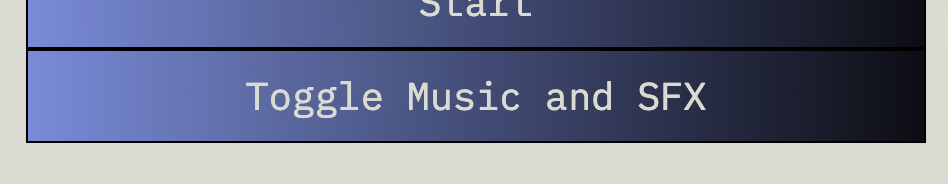
​

## **Features**
​
#### **Splash Screen** 

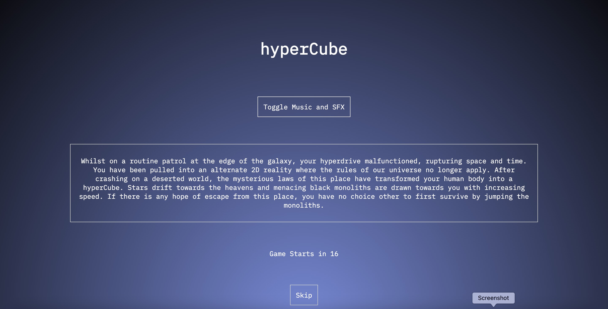

* The splash screen features a gradient background featuring the colours outlined above.
* There is an h1 heading featuring the title of the game.
* The music and SFX button is below the heading. By default, the music and SFX do not play. The button will toggle both.
* The synopsis is in a bordered div and gives a brief story for the user in order to engage them in the game.
* Beneath the synopsis is a countdown timer which counts from 20 seconds to zero, giving the user time to read the synopsis and/or toggle the music.
* FInally, there is a skip button which gives the user the option of skipping the splash screen entirely, either when they are ready or if they have visited the site on multiple occasions.
* All text is white (#FFF) to offer a contrast to the background and the borders are slightly softer (#DADBD0) to offer a softer contrast.

#### **Game Start Screen** 
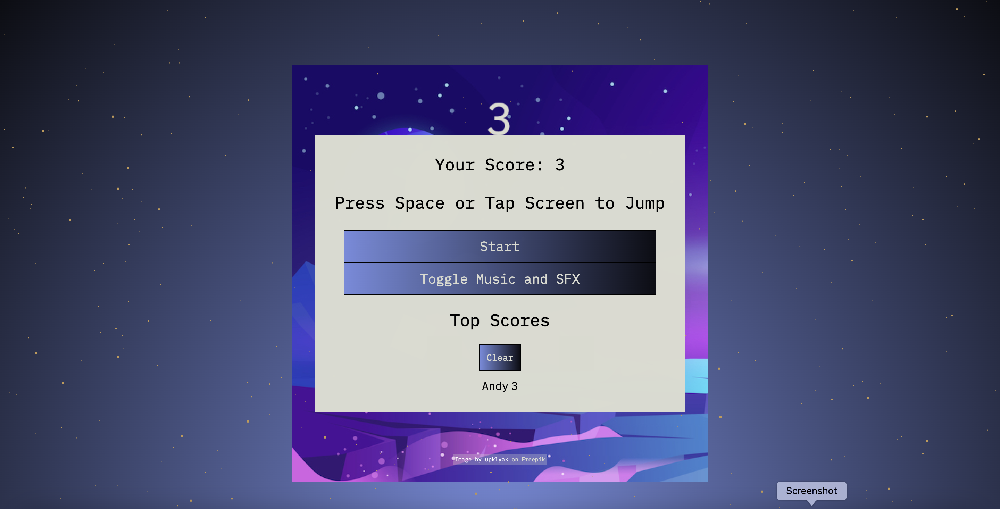

* Once the splash screen has counted down or been skipped, the game screen presents the user with the game canvas which is partially covered with the overlay card. The card features a start button which starts the game.
* There is also a toggle music button which works in the same manner as the one on the splash screen. As there will be too little time to adjust these effects during gameplay, it makes most sense to have the button situated here.
* The card also features the leaderboard which utilises local storage to save the top 5 high scores. The scores will remain in the browser on refresh and restart.
* The clear button will remove all saved high scores from local storage ready for the table to be populated anew.
* The background for this screen is a CSS animation which features small stars drifting slowly upwards. It was important to choose a background that wasn't too demanding in terms of processing power as well as one that minimised distraction during gameplay. However, I feel it contributes well to the overall atmosphere and immersion in the game. 

#### **The Game Itself** 

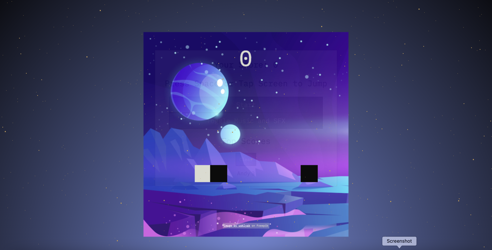

* Upon start, the player character (the white square) appears to move towards the black 'monoliths'. In terms of the game logic, it is actually only the monoliths that move.
* The player character jumps through a press of the spacebar or a screen tap on mobile devices. Upon jumping the player character executes a perfect 360 degree jump.
* For every 10 blocks that are successfully jumped, the speed of the black monoliths increases.
* The player scores a point for every obsatcle that is successfully cleared.
* As it is an endless jumper, the goal is to score the highest on the leaderboard. 
* If the player achieves a top 5 high score they are prompted to enter their name in the leaderboard.

 

​
## **Future-Enhancements**
​
There are a various areas with scope for future improvement. This project has been fun and challenging and I will continue to try to add the following features in my own time:
​
* Creating a sprite and sprite sheet for the player character.
* Additional sound effects.
* Add different types of obstacle or enemy.
* The ability to collect items whilst jumping.
* Platforms to jump on to.
* The abiity to collect an item which slows down the obstacles temporarily.
* The ability to move left and right.
​
## **Testing Phase**
​
**Responsiveness**

* Responsiveness was tested extensively using Chrome Dev Tools. This proved invaluable when creating each page and was instrumental in helping me ensure responsiveness on multiple devices and screen sizes. The ability to experiment with the code saved a lot of trial and error within gitpod.
* User testing was conducted on the following devices: Apple iPhone 12, Apple iPad Air 2021, Apple Macbook Air 2021, Apple MacBook Pro 2021. 
* As I was limited to Apple devices only I sent the link to various friends and colleagues so they could check responsiveness on further devices including Windows desktop PCs, Amazon tablets and Samsung Galaxy S12. In each case, the pages responded as expected.
* Using CSS grid was hugely helpful when it came to the splash screen and it resizes well regardless of the device.

* **Splash Screen**

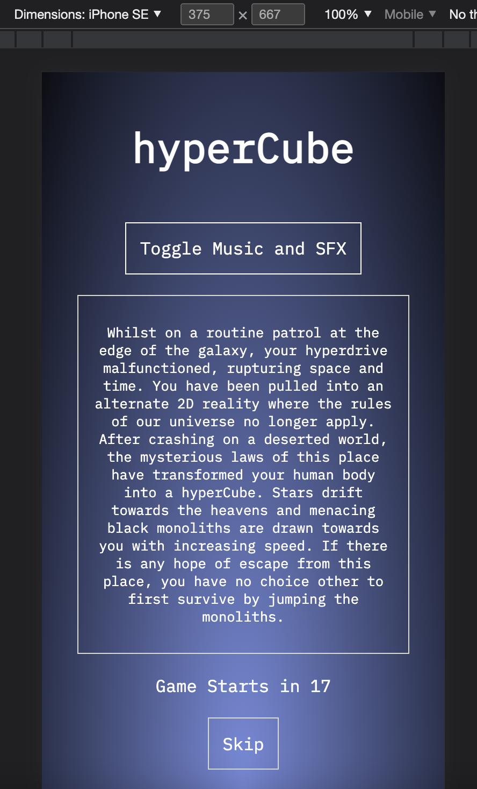

* **Game Screen**

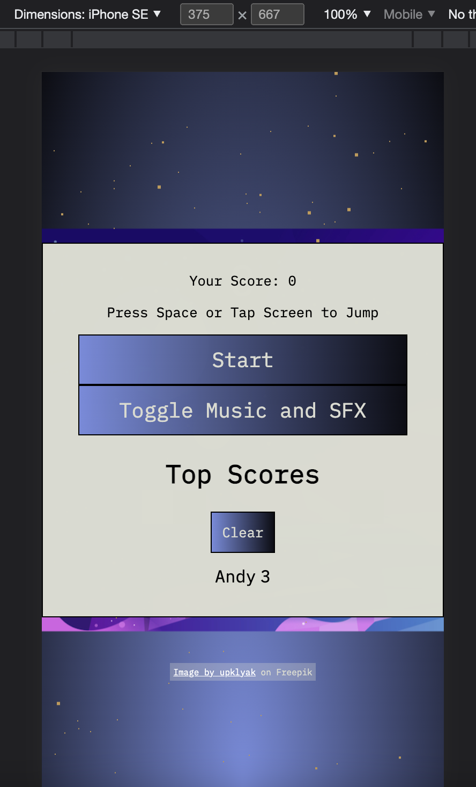
​

**Functionality**

* Each feature was user-tested numerous times. All links were clicked and images checked.
* On desktop, all buttons and controls function perfectly. The music and SFX toggle on and off as expected. 
* The javascript functions as expected regardless on desktop. 
* The skip button fucntions perfectly regardless of the device.
* The animated background functions well on desktop and mobile.
* The game runs as expected on desktop and mobile. 
* The leaderboard functions as intended on desktop and mobile. 
* I used *Lighthouse* to test each page. Results below:

* 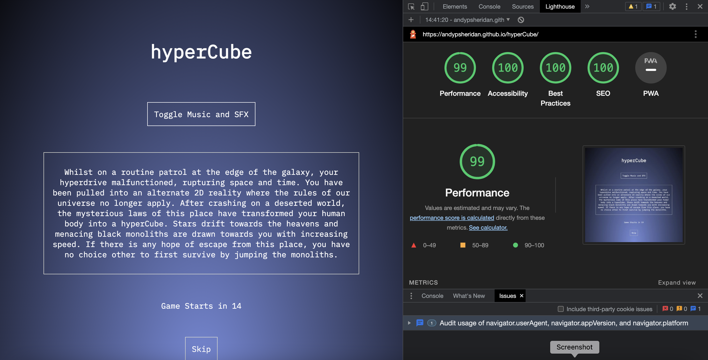
* 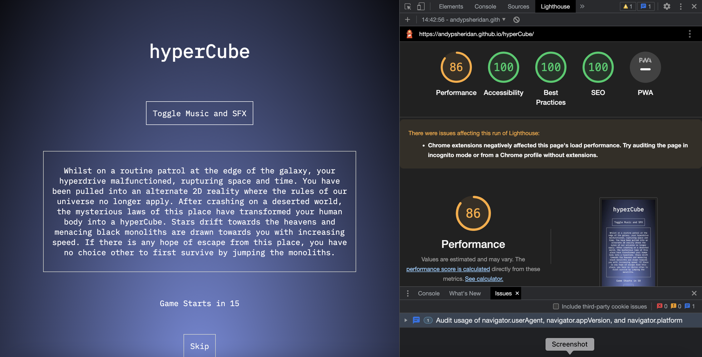

* The page performs well.
* The desktop score performance score is 99% and the mobile score is 85%.
* The game scores 100% in terms of accessibility, best practices and SEO.

​
**Validators**

* HTML Validation using w3c validator -  passed validation

* 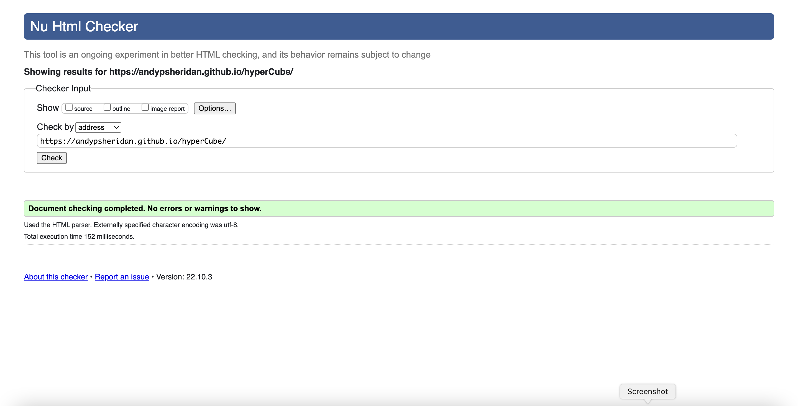

* CSS Validation using w3c jigsaw - passed validation

* 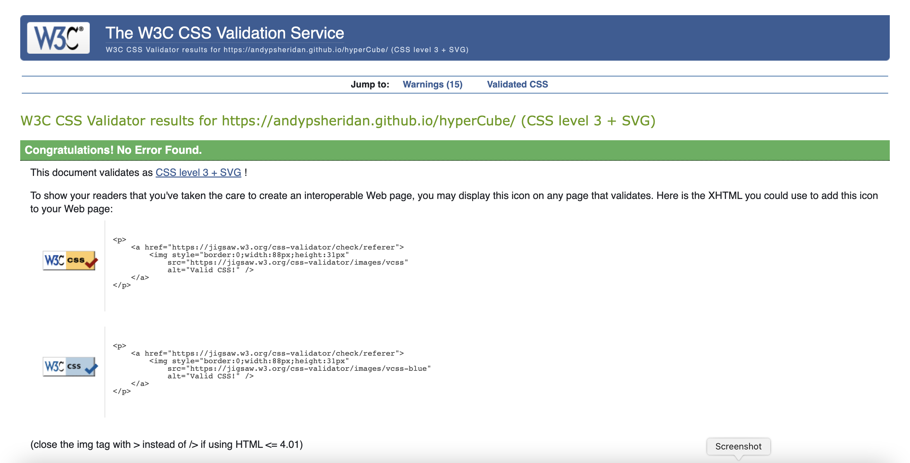

* JavaScript Validation using jShint - passed validation. The report stated that there are two unused variables but they are integral to the game and called from the DOM. There are two warnings which refer to ternary expressions.

* 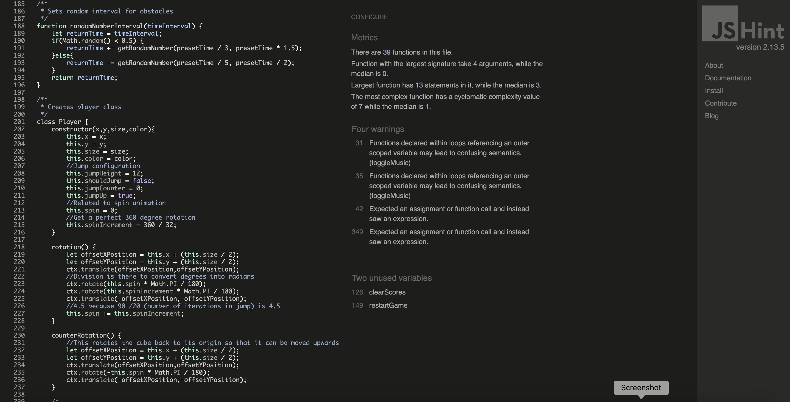

​
​
## **Bugs**
​
The following bugs were identified during user testing:

* 🐞 - At first it was not possible to get the music to play on any device.
* ⚒️ - The file was unplayable when situated in my assets or audio folder.
* ✅ - I added the audio file to the root directory and it worked.

 

* 🐞 - The SFX ran by default on all devices which could be undesirable for many users.
* ⚒️ - The corresponding JS function specified volume on page load.
* ✅ - Set the volume to zero until the user clicks or taps the toggle music and SFX button

​ 

* 🐞 - The game music had a hissing sound which affected the user experience.
* ⚒️ - I used a .wav file which had become distorted after compression.
* ✅ - Converted to an .mp3 file which was smaller than the compressed .wav file but sounds fine.

 

* 🐞 - The original SCSS background worked well on a MacBook Pro but caused huge lag and unplayable game quality on some devices.
* ⚒️ - The SCSS was too CPU intensive on some devices.
* ✅ - I used a different background animation which was more subtle but works on all devices in testing.

 

* 🐞 - The game was initially too hard.
* ⚒️ - The speed of each block was too fast.
* ✅ - Slowed the starting speed of the blocks and set them to move incrementally faster.

 

* 🐞 - The skip button on the splash screen would be hidden by the browser bar on smaller mobile devices. This meant users who had played the game multiple occasiosn would have to wait for the countdown to finish.
* ⚒️ - Whilst the page is responsive it dodn't take into account the browser bar.
* ✅ - Adjusted the CSS grid spacing to take into account screen sizes of 415px and smaller which accounts for mobile devices.

 

* 🐞 - The score SFX would not play on loading of the page which was as intended, however upon toggling sound on and off it would continue to play even when the music and jump SFX would be muted.
* ⚒️ - The score SFX had been tied to intricately to the game itself.
* ✅ - I had been uncertain about the score SFX and although it worked well on desktop, there was sometimes a lag on certain mobile devices so I removed it altogether.

 

## **Unfixed Bugs**

* There is an issue when running the game in mobile compatibility mode on Dev Tools. The following error is displayed in the console upon simulation of a touch event: Unable to preventDefault inside passive event listener due to target being treated as passive. Although I was able to fix this, when I ran the game on Apple touch devices, the jump function no longer worked so was not a viable solution.
The bug does not affect the playability or performance of the game or page in any way, but this remains a minor bug for the time being.

## **Deployment**
I deployed the page on GitHub pages via the following procedure: -
​
1. From the project's [repository](https://github.com/AndypSheridan/hyperCube), go to the **Settings** tab.
2. From the left-hand menu, select the **Pages** tab.
3. Under the **Source** section, select the **Main** branch from the drop-down menu and click **Save**.
4. A message will be displayed to indicate a successful deployment to GitHub pages and provide the live link.
​
The live site can be found can be found at the following URL - https://andypsheridan.github.io/hyperCube/

***
​
## **Tech**
​
I used the following technologies for the STA project:
​
- HTML
- CSS
- SCSS
- JavaScript

## **Software**

The following software was used:

- Gitpod to create, load and push my code to Github.
- Git (Gitpod and Github) as my version control for the site.
- Audacity Desktop to convert and compress my .wav file to mp3.
- Balsamiq wireframes software.
- JShint online JavaScript code checker https://jshint.com/
- W3C Markup Validation Service https://validator.w3.org/
- W3C Jigsaw CSS Validation Service https://jigsaw.w3.org/css-validator/
​

 

## **Credits**
​
### **Content:**

* Core elements of the game use code written by YouTube user in the following video: Qixotl LFC https://www.youtube.com/watch?v=gnPekEXhkys

* Whilst the game is now very different, this video gave me a good platform to create a very basic jumping game.

### **Media:**

* The background CSS is copied from Riley Pearce on CodePen: https://codepen.io/riley-pearce/pen/OJWPjZM?fbclid=IwAR2HwzINeVhFg7-YQvFDV8Teh-IH6akXO9RY3uMTapRobDt-R9fJ6-GIMkY

* The in-game is from open source digital library https://archive.org/
Here is the link: 
Jump SFX: https://archive.org/download/jump_20210424/jump.wav

* The game canvas background image was found on Freepik. The attribution is on the game screen. 
The URL is "https://www.freepik.com/free-vector/cosmic-background-alien-planet-deserted-landscape-with-mountains_13924256.htm#query=game%20background&position=12&from_view=keyword"

* The in-game music is freeware from Christopher at IndieGameMusic.com. 
Here is the link to the file: https://www.indiegamemusic.com/viewtrack.php?id=5620

* The favicon was generated using the online favicon generator at: https://favicon.io/

### **Honorable mentions**
* Thank you to my mentor, Richard Wells, who gave a significant amount of his time to provide me with feedback and ideas on the project; he has been invaluable in so many ways and a genuine source of motivation for me.
* Thanks to Code Institute for providing me with some basic knowledge of JavaScript.
* Thanks also to Codecademy which I used alongside to help reinforce my knowledge.
* Thanks to the Code Institute community on Slack who helped remind me that everyone has difficult days.
* A huge thank you to my partner Jess who is better at the game than me.
* Thanks to my oldest son Arthur who said the game was too hard, but learned that perseverance at these pays off in the end.